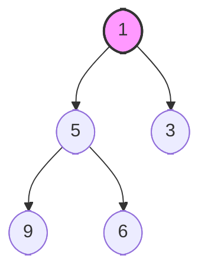
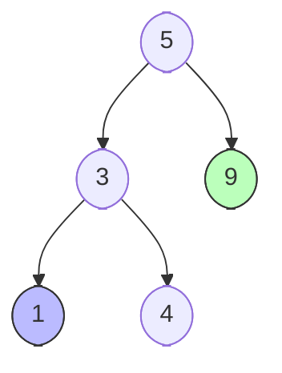

- PriorityQueue: 힙(Heap) 자료구조 기반
- [[Set, Map 및 Hash, Tree 비교|TreeSet, TreeMap]]: 이진 탐색 트리(Red-Black 트리) 자료구조 기반

---
# 힙(Heap)

- `PriorityQueue`가 사용하는 힙은 오직 **부모와 자식 간의 대소 관계**만 신경씀
	- **규칙:** `부모 노드의 값 ≤ 자식 노드의 값`
	- 형제 노드끼리는 왼쪽이 큰지 오른쪽이 큰지 전혀 상관하지 않음. 오직 **전체 트리에서 가장 작은 값이 맨 위(루트)에 온다**는 것만 보장

- 항상 최솟값이 루트에 위치하여 O(1) 탐색이 가능
- `5`와 `3`은 형제 노드이지만 왼쪽(`5`)이 더 커도 아무 상관 없는 **느슨한 정렬** 상태

---
# 이진 탐색 트리(Binary Search Tree)

- `TreeSet`과 `TreeMap`이 사용하는 레드-블랙 트리는 **부모를 기준으로 왼쪽과 오른쪽의 방향**을 엄격하게 나눔
	- **규칙:** `왼쪽 자식들의 값 < 부모 노드의 값 < 오른쪽 자식들의 값`
	- 트리를 왼쪽 끝부터 오른쪽 끝까지 순서대로 읽으면 완전히 정렬된 수열이 나오는 **중위 순회(In-order Traversal)** 구조

- `5`는 기준이 되는 부모 노드이며, 왼쪽 서브트리는 무조건 `5`보다 작고 오른쪽 서브트리는 무조건 5보다 큼
- 가장 왼쪽 끝인 `1`이 **최솟값**, 가장 오른쪽 끝인 `9`가 **최댓값**이 되며 두 값 모두 O(log N)만에 탐색이 가능

---
# 시간복잡도 및 특징

|             | 힙 (최소힙 기준)                   | 이진 탐색 트리                          |
| :---------- | :--------------------------- | :-------------------------------- |
| **최솟값 탐색**  | **$O(1)$** (루트 노드 확인)        | **$O(\log N)$** (가장 왼쪽 끝 추적)      |
| **최댓값 탐색**  | **$O(N)$** (리프 노드 완전 탐색)     | **$O(\log N)$** (가장 오른쪽 끝 추적)     |
| **데이터 삽입**  | $O(\log N)$                  | $O(\log N)$                       |
| **데이터 삭제**  | $O(\log N)$ (루트 노드 삭제 기준)    | $O(\log N)$ (특정 노드 지정 삭제 가능)      |
| **정렬 상태**   | **느슨한 정렬** (부모-자식 간 대소만 유지)  | **완벽한 정렬** (좌측은 작고, 우측은 크게 유지)    |
| **중복 값 허용** | **허용함**                      | **불가**                            |
| **주요 용도**   | 실시간 최솟값/최댓값 **하나만** 계속 뽑아낼 때 | 최솟값/최댓값 **동시 제어** 및 전체 정렬·범위 탐색 시 |
